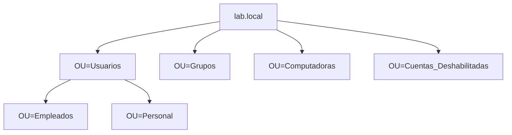

# 🖥️ Active Directory Lab


---

## 📘 Descripción general

Este laboratorio fue realizado para practicar la instalación y configuración básica de **Active Directory Domain Services (AD DS)** en **Windows Server**, junto con la creación y administración de usuarios, grupos, políticas de contraseñas y permisos sobre recursos compartidos.

---

## 🎯 Objetivos principales

- Instalar un **Windows Server** y configurar un **dominio** (`lab.local`).
- Crear y organizar **Unidades Organizativas (OUs)**.
- Crear **usuarios y grupos de seguridad**.
- Configurar **políticas de contraseñas** mediante **Group Policy**.
- Gestionar **altas, bajas y modificaciones** de usuarios.
- Asignar **permisos en recursos compartidos** basados en grupos.

---

## ⚙️ Tecnologías utilizadas

| Componente | Descripción |
|-------------|-------------|
| 💽 **Windows Server 2022** | Servidor principal y controlador de dominio |
| 💻 **Windows 10** | Cliente para pruebas de autenticación |
| 🧠 **Active Directory (AD DS)** | Servicio de directorio |
| 🔐 **DNS Server** | Resolución interna para el dominio |
| 🪟 **Group Policy Management Console (GPMC)** | Gestión de políticas de contraseñas |
| ⚡ **PowerShell** | Automatización de tareas |
| 🧱 **VirtualBox** | Entorno de virtualización del laboratorio |

---

## 🧩 Estructura del dominio


---

## 👥 Usuarios y grupos creados

| Tipo | Nombre | Descripción |
|------|---------|-------------|
| 🧍 Usuario | `Graciela Romero (gromero)` | Usuario de ejemplo, Empleados |
| 🧍 Usuario | `Julieta Gomez (jgomez)` | Usuario de ejemplo, Empleados |
| 🧍 Usuario | `Luciano Sosa (lsosa)` | Usuario de ejemplo, Empleados |
| 🧍 Usuario | `Martin Gonzalez (mgonzalez)` | Usuario de ejemplo, Empleados |
| 👥 Grupo | `G_Empleados` | Grupo global de seguridad para empleados |
| 👥 Grupo | `G_Administradores` | Grupo global de seguridad para personal administrativo |
| 👥 Grupo | `G_Contadores` | Grupo global de seguridad para personal sector contadores |

---

## 🔐 Políticas de contraseñas

Configuradas en la **Default Domain Policy** mediante **Group Policy Management Console (GPMC)**:

| Parámetro | Valor |
|------------|--------|
| Longitud mínima | 10 caracteres |
| Complejidad | Activada |
| Bloqueo tras intentos fallidos | 5 intentos |
| Duración del bloqueo | 15 minutos |
| Vencimiento de contraseñas | 30 días |

---

## 🧰 Gestión de usuarios

- **Altas:** creación de usuarios con contraseñas iniciales y obligación de cambio en primer inicio.  
- **Modificaciones:** actualización de datos (departamento, título, etc.).  
- **Bajas:** deshabilitación y movimiento de cuentas a la OU `Cuentas_Deshabilitadas` antes de su eliminación definitiva.

---

## 📁 Permisos sobre recursos compartidos

- Carpeta compartida: `Permisos_Compartidos`
- Permisos NTFS y de recurso asignados al grupo `G_Empleados`.

Esto garantiza que solo los miembros del grupo puedan acceder a la carpeta.

---

## 🧾 Ejemplos de comandos PowerShell

```powershell
# Crear OU
New-ADOrganizationalUnit -Name "Empleados" -Path "DC=lab,DC=local"

# Crear usuario
New-ADUser -Name "Luciano Sosa" -SamAccountName "lsosa" -UserPrincipalName "lsosa@lab.local" `
  -Path "OU=Empleados,DC=lab,DC=local" -AccountPassword (ConvertTo-SecureString "P@ssw0rd1" -AsPlainText -Force) `
  -Enabled $true

# Crear grupo
New-ADGroup -Name "G_empleados" -GroupScope Global -GroupCategory Security -Path "OU=Grupos,DC=lab,DC=local"

# Agregar usuarios al grupo
Add-ADGroupMember -Identity "G_Empleados" -Members "lsosa","jgomez"

# Deshabilitar cuenta
Disable-ADAccount -Identity "gromero"
```

## 👩‍💻 Autora

**Ingrid K.**  

[](https://linkedin.com/in/ingrid-k)
[](mailto:ingridkaufmannok@gmail.com)
