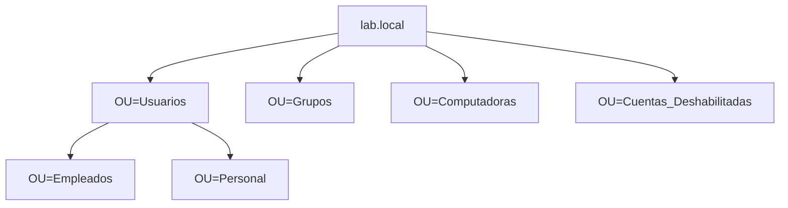

# 🛡 LAB: Active Directory

---

## 🌟 Descripción

Laboratorio práctico orientado a la instalación y configuración básica de **Active Directory Domain Services (AD DS)** en un entorno aislado con **Windows Server**.  
Incluye la creación de un dominio, usuarios, grupos, políticas de contraseñas y permisos sobre recursos compartidos, con el objetivo de reforzar habilidades esenciales para roles de **Blue Team / SOC / Administración de Sistemas**.

---

## 🎯 Objetivos principales

• Implementar un **dominio AD DS** (`lab.local`) en Windows Server.  
• Crear y organizar **Unidades Organizativas (OUs)**.  
• Administrar **usuarios, grupos y roles**.  
• Configurar **políticas de contraseñas** mediante Group Policy.  
• Gestionar **altas, bajas y modificaciones** de cuentas.  
• Asignar **permisos NTFS y de red** basados en grupos.

---

## 📁 Estructura del dominio

---
## 📬 Contacto

  
 
